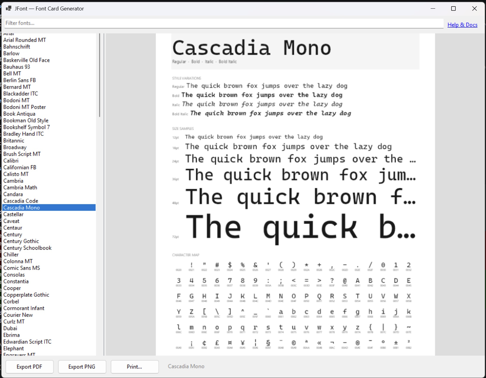

# JFont — Font Card Generator

A Windows desktop app that generates printable font reference cards for any installed font on your system.



## What it does

Select a font from the list and JFont renders a US Letter-sized card showing:

- **Header** — font family name and available style variants
- **Style Variations** — sample text in Regular, Bold, Italic, and Bold Italic
- **Size Samples** — sample text at 12, 18, 24, 36, 48, and 72 pt
- **Character Map** — every glyph from U+0020 through U+00FF (Basic Latin + Latin-1 Supplement)

Cards can be exported as **PDF**, **PNG** (144 DPI), or sent directly to a **printer**.

## Requirements

- Windows 10/11
- [.NET 8 Runtime](https://dotnet.microsoft.com/download/dotnet/8.0) (Desktop)

## Building

```
dotnet build
```

Or open `JFont.slnx` in Visual Studio 2022.

## Usage

1. Launch `JFont.exe`
2. Type in the filter box to narrow the font list
3. Click a font to preview its card
4. Use **Export PDF**, **Export PNG**, or **Print…** to save or print

> Non-Latin fonts (CJK, Arabic, Hebrew, etc.) are not yet supported.

## Tech

- **WinForms** (.NET 8) — UI shell
- **SkiaSharp** — card rendering and PDF/PNG export

## Links

- [jlion.com/tools/jfont](https://www.jlion.com/tools/jfont)
